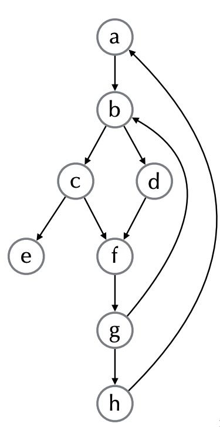

Before optimizing a loop, we need to first define a loop in the control flow graph. Note that each node in a control flow graph is a basic block.

## Identifying loops
Cycles are not necessary loops. A `loop` is a `subset S of nodes` where:
 - S is strongly connected. In other words, for any two nodes in S, there is a path from one to the other using only nodes in S
 - There is a distinguished header node *`h∈S`* such that there is no edge from a node outside S to *`S\{h}`*

### Dominators
Node d `dominates` node n in a graph (d `dom` n) if every path from
the start node to n goes through d

Dominators can be organized as a tree
  - a ->b in the dominator tree iff a immediately dominates b

### Back edge
Back edge is an edge from n to dominator d.

### Example

In the above example, we have:

- a dominates a,b,c,d,e,f,g,h 
- b dominates b,c,d,e,f,g,h 
- c dominates c,e 
- d dominates d 
- e dominates e 
- f dominates f,g,h 
- g dominates g,h 
- h dominates h 
- back-edges? g→b, h→a

### Natural Loops
The natural loop of a back edge is the `smallest set of nodes` that includes the head and tail of the `back edge`, and has no predecessors outside the set, except for the predecessors of the header.
  - Single entry-point: header that dominates all nodes in the loop

Algorithm to Find Natural Loops:
1. Find the dominator relations in a flow graph
2. Identify the back edges
3. Find the natural loop associated with the back edge

## Loop unrolling

## Loop fusion

## Loop tiling

## Loop parallelization

### Reference
[Wiki: Control Flow Graph](https://en.wikipedia.org/wiki/Control-flow_graph)\
[CSC D70: Compiler Optimization LICM (Loop Invariant Code Motion)](http://www.cs.toronto.edu/~pekhimenko/courses/cscd70-w18/docs/Lecture%205%20[LICM%20and%20Strength%20Reduction]%2002.08.2018.pdf)